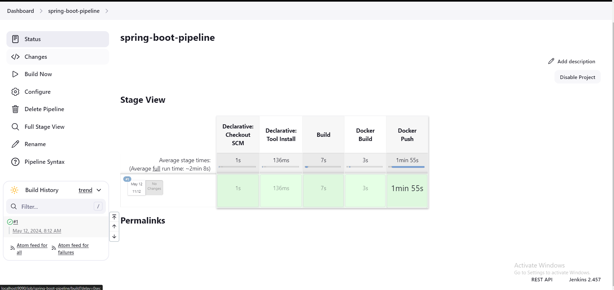

# Spring Boot Automation Pipeline With Jenkins

## Project Purpose
* Automating the software development life cycle

## Things I did to develop this project

1. Initialize spring boot project
2. Create Dockerfile

3. Install and Run Jenkins server on docker 
4. Configure Jenkins server to work properly
    * Configure Global Tools (Maven , JDK 21)
    * Set Credentials (Docker Hub)
    
4. Create Jenkins Pipeline
5. Create Jenkinsfile 

## Developer Machine Status
* Jenkins Version: 2.457
* Operation System: Windwos 11
* Jenkins Server Work Environment: Docker Container

## Pipeline View

# Jenkins İle Spring Boot Proje Otomasyonu

## Projenin Amacı
* Yazılım geliştirme sürecini otonom hale getirmek

## Geliştirme Süreci

1. Spring boot projesini oluştur
2. Dockerfile dosyasını oluştur

3. Jenkins sunucusunu kur ve docker container üzerinde çalıştır
4. Jenkins sunucusunu konfigüre et
    * Global araçları kur (Maven , JDK 21)
    * Kimlik Bilgilerini (Credentials) ayarla (Docker Hub)
    
4. Jenkins Pipeline'nını oluştur
5. Jenkinsfile dosyasını oluştur

## Geliştirilen Makina Bilgileri
* Jenkins Versiyonu: 2.457
* İşletim Sistemi: Windwos 11
* Jenkins Sunucusu Çalışma Ortamı: Docker Container

## Pipeline Görseli

